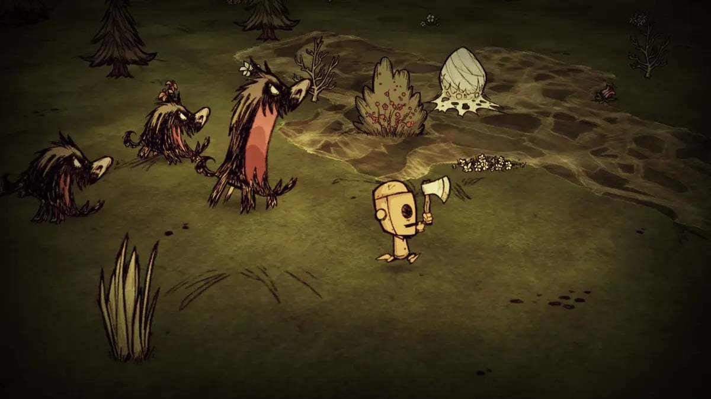
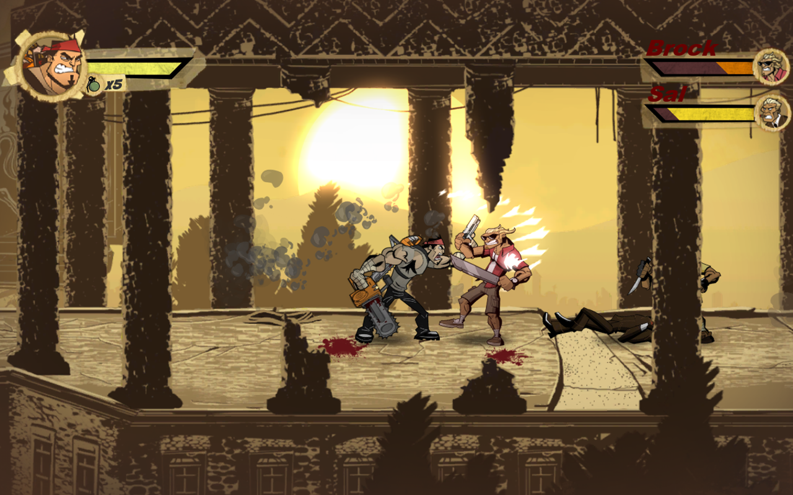
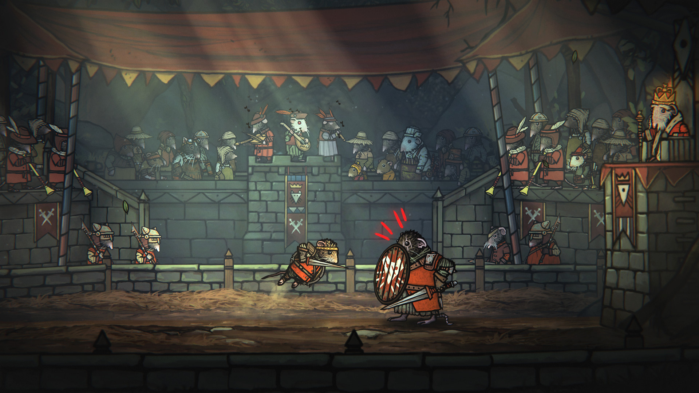
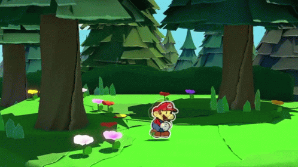

# Game Design Document

This document gives an overview of the project.

## 1. Content

- [1. Content](#1-content)
- [2. Context](#2-context)
  - [2.1 Purpose](#21-purpose)
  - [2.2 Target Audience and Setting](#22-target-audience-and-setting)
  - [2.3 Team Structure and Responsibilities](#23-team-structure-and-responsibilities)
- [3. Design](#3-design)
  - [3.1 Fantasy](#31-fantasy)
  - [3.2 Gameplay Mechanics](#32-gameplay-mechanics)
  - [3.3 Art Style and Visuals](#33-art-style-and-visuals)
  - [3.4 Audio and Music](#34-audio-and-music)
- [4. Development](#4-development)
  - [4.1 Tools](#41-tools)
  - [4.2 Timeline and Milestones](#42-timeline-and-milestones)

## 2. Context

The learning game is being developed as a submission for the 15th Pirate Software Game Jam. The themes of the game jam are "Shadows" and "Alchemy", both of which needs to be featured in the game. The game jam takes place from the 17th of July until the 31st of July and therefore has a duration of two weeks.

### 2.1 Purpose

- The developers should have fun.
- The developers should improve their game development skills.
- The developers should end up with an artifact which demonstrates their development skills.
- Educational institutions should have access to another tool for teaching introductory optics.

### 2.2 Target Audience and Setting

The target audience for the game is high school students, playing on relatively weak laptops, at home or in the classroom. The game is only meant to give an intuition about optics before the topic is tackled more thoroughly.

The scope of the target setting is reduced by (1) assuming that laptops do not have touch input, (2) that the laptops are connected to the internet, (3) that they have browsers that can open websites, and (4) that the players understand English.

### 2.3 Team Structure and Responsibilities

The development team consist of: Leo, responsible for game design, pedagogy, programming, music, and audio; and RP, responsible for visuals.

## 3. Design

### 3.1 Fantasy

Playing as an alchemist that is actually just doing chemistry.

### 3.2 Gameplay Mechanics

#### Characteristics

<table>
  <tr>
    <th>Characteristics</th>
    <th>Description</th>
  </tr>
  <tr>
    <td>Density</td>
    <td>Substances has density, affecting their buoyancy when submerged in each other.</td>
  </tr>
  <tr>
    <td>Temperature</td>
    <td>Substances can be either warm or cold. Temperature characteristics might be conditions for certain chemical reactions. Temperature might affect density.</td>
  </tr>
  <tr>
    <td>Vitality</td>
    <td>Creatures have vitality – the amount of life and energy they have left.</td>
  </tr>
</table>

#### Phenomena

<table>
  <tr>
    <th>Phenomenon</th>
    <th>Description</th>
  </tr>
  <tr>
    <td>Burn damage</td>
    <td>Water-based creatures take damage when at high temperature, and carbon-based creatures take damage when at very high temperatures.</td>
  </tr>
  <tr>
    <td>Explosion</td>
    <td>An event where matter is pushed away from a center.</td>
  </tr>
</table>

#### Substance Interactions

<table>
  <tr>
    <th>Substance</th>
    <th>Nickname</th>
    <th>Interactions</th>
  </tr>
  <tr>
    <td rowspan="4">Carbon dioxide gas</td>
    <td>Coal acid</td>
    <td>Is released during burning of coal.</td>
  </tr>
  <tr>
    <td>Coal acid</td>
    <td>Forms <em>carbonic acid</em> when dissolved in water.</td>
  </tr>
  <tr>
    <td>...</td>
    <td>Can displace <em>flame gas</em> so that fires die.</td>
  </tr>
  <tr>
    <td>...</td>
    <td>Can displace <em>vital gas</em> so that breathing creatures suffocate.</td>
  </tr>
  <tr>
    <td rowspan="2">Nitrogen gas</td>
    <td>Choke gas</td>
    <td>Can displace <em>vital gas</em> so that breathing creatures suffocate.</td>
  </tr>
  <tr>
    <td>Choke gas</td>
    <td>Can displace <em>flame gas</em> so that fires die.</td>
  </tr>
  <tr>
    <td rowspan="4">Oxygen gas</td>
    <td>Flame gas</td>
    <td>Necessary for combustion and sustaining fire.</td>
  </tr>
  <tr>
    <td>Acid substance</td>
    <td rowspan="2">Takes part in some reactions that generate acids.</td>
  </tr>
  <tr>
    <td>Oxy-gen</td>
  </tr>
  <tr>
    <td>Vital gas</td>
    <td>All breathing creatures can only survive short periods of time without <em>vital gas</em>. The gas is vital for them.</td>
  </tr>
  <tr>
    <td rowspan="2">Oxyhydrogen</td>
    <td>Oxy-hydro-gen</td>
    <td>Is created by mixing <em>oxygen</em> and <em>hydrogen</em>.</td>
  </tr>
  <tr>
    <td>Boom gas</td>
    <td>Combusts at high temperatures, creating an explosion and <em>water vapor</em>.</td>
  </tr>
  <tr>
    <td>Water vapor</td>
    <td>...</td>
    <td>Condenses to water at cold temperatures.</td>
  </tr>
  <tr>
    <td>Water</td>
    <td>...</td>
    <td>Boils to water vapor at high temperatures.</td>
  </tr>
</table>

Multiple names used for the same gases or substances as well as the history of the name to give clues about the game mechanics.

- Hydrogen
  - Gas that can generate water when combusted with oxygen.
    - Hydro-gen (en.) ("gen" has the same origin as "generating")
    - Water substance (nb: "vannstoff")
- Oxygen
  - Gas that sustains flames.
    - Flame gas / flame air (sv: "eldluft")
  - Gas that is part of reactions that create acid.
    - Acid substance (nb: "surstoff")
    - Oxy-gen (en.) (oxy means "acid", comes from Greek meaning "sharp") ("gen" has the same origin as "generating")
  - Gas that is vital to life.
    - Vital gas / vital air (nb: "vitalluft")
- Oxyhydrogen
  - Gas that explodes when ignited.
    - Boom gas (nb: "knallgass")
  - Gas that is a mixture of oxygen and hydrogen.
    - Oxyhydrogen
- Nitrogen
  - Gas that causes asphyxiation.
    - Choke gas / choke substance (nb: "kvelstoff")

### 3.3 Art Style and Visuals

- Cutout
- Stop motion

  
Screenshot from _Don't Starve_ showing a cutout style.

  
Screenshot from _Shank_ showing a cutout-like style.

  
Screenshot from _Tails of Iron_ showing a cutout-like style.

  
.GIF from _Paper Mario: The Origami King_ showing animations with the cutout style.

### 3.4 Audio and Music

## 4. Development

### 4.1 Tools

The game will be developed in Unity. Unity offers a solid mix of 2D and 3D rendering features that fit well to the planned 2.5D art style. It is also the engine that the programmer is most used to.

### 4.2 Timeline and Milestones

<table>
  <tr>
    <th>Milestone</th>
    <th colspan="2">Due date</th>
    <th colspan="2">Completion Time</th>
    <th>Comment</th>
  </tr>
  <tr>
    <td>Initial player movement system</td>
    <td>T-9d-13h</td>
    <td>2024-07-22 Z 00:00</td>
    <td style="background-color: #EF9A9A; color: black;">+1d15h</td>
    <td>2024-07-23 Z 15:00</td>
    <td>Included setting up Godot project, scrapping it, then setting up the Unity project.</td>
  </tr>
  <tr>
    <td>Initial creature movement system</td>
    <td>T-9d-13h</td>
    <td>2024-07-22 Z 00:00</td>
    <td></td>
    <td></td>
    <td></td>
  </tr>
  <tr>
    <td>Initial vitality system</td>
    <td>T-8d-13h</td>
    <td>2024-07-23 Z 00:00</td>
    <td style="background-color: #EF9A9A; color: black;">+17h</td>
    <td>2024-07-23 Z 17:00</td>
    <td></td>
  </tr>
  <tr>
    <td>Initial ladle swing system</td>
    <td>T-8d-13h</td>
    <td>2024-07-23 Z 00:00</td>
    <td></td>
    <td></td>
    <td></td>
  </tr>
  <tr>
    <td>Initial gas system</td>
    <td>T-7d-13h</td>
    <td>2024-07-24 Z 00:00</td>
    <td></td>
    <td></td>
    <td></td>
  </tr>
  <tr>
    <td>Add oxygen</td>
    <td>T-7d-13h</td>
    <td>2024-07-24 Z 00:00</td>
    <td></td>
    <td></td>
    <td></td>
  </tr>
  <tr>
    <td>Add hydrogen</td>
    <td>T-7d-13h</td>
    <td>2024-07-24 Z 00:00</td>
    <td></td>
    <td></td>
    <td></td>
  </tr>
  <tr>
    <td>Initial temperature system</td>
    <td>T-7d-13h</td>
    <td>2024-07-24 Z 00:00</td>
    <td></td>
    <td></td>
    <td></td>
  </tr>
  <tr>
    <td>Initial explosion system</td>
    <td>T-7d-13h</td>
    <td>2024-07-24 Z 00:00</td>
    <td></td>
    <td></td>
    <td></td>
  </tr>
  <tr>
    <td>Initial suffocation system</td>
    <td></td>
    <td></td>
    <td></td>
    <td></td>
    <td></td>
  </tr>
  <tr>
    <td>Initial player movement animation system</td>
    <td></td>
    <td></td>
    <td></td>
    <td></td>
    <td></td>
  </tr>
  <tr>
    <td>Initial creature movement animation system</td>
    <td></td>
    <td></td>
    <td></td>
    <td></td>
    <td></td>
  </tr>
  <tr>
    <td>Design and implement levels 1-5</td>
    <td>T-6d-14h</td>
    <td>2024-07-24 Z 23:00</td>
    <td></td>
    <td></td>
    <td></td>
  </tr>
  <tr>
    <td>Submit</td>
    <td>T-13h</td>
    <td>2024-07-31 Z 00:00</td>
    <td></td>
    <td></td>
    <td></td>
  </tr>
</table>

T is the submission deadline.
